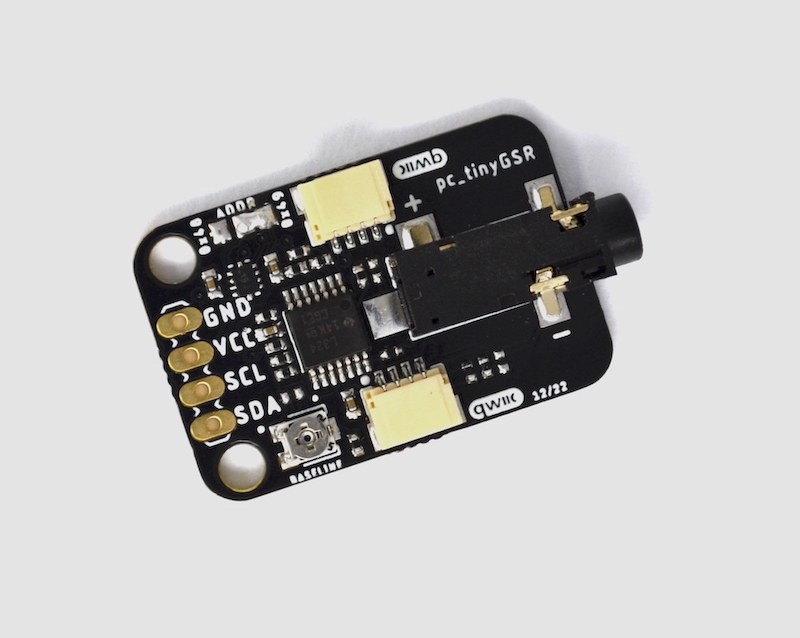
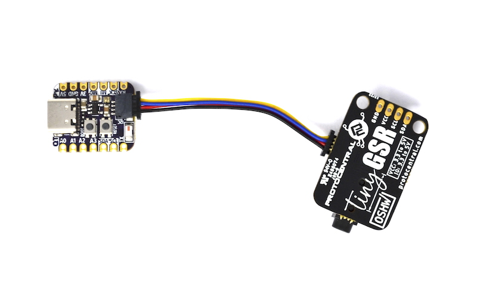

# ProtoCentral tinyGSR 

 

## Don't have one? [Buy it here](https://protocentral.com/product/protocentral-tinygsr-breakout-board-qwiic-stemma-qt/)

Protocentral tinyGSR is a [Galvanic Skin Response (GSR) / Electrodermal Activity (EDA)](https://en.wikipedia.org/wiki/Electrodermal_activity) measurement breakout board that allows you to measure and track your physiological responses in real time. GSR measures the changes in electrical conductivity / Electrodermal acivity of the skin, providing valuable insights into a person's emotional state and stress levels. When a person is emotionally aroused or stressed, their sweat gland activity increases, which can be measured as changes in the electrical conductivity of the skin. 

tinyGSR contains onboard analog op-amps to measure this change in resistance and helps you to easily interface this with your microcontroller system using just a digital interface. tinyGSR can be a powerful tool for anyone looking to better understand their body and emotions. The tinyGSR has Qwiic compatible connector, in addition to standard breakout headers to just plug it into any compatible board with no soldering required. 

## Hardware Setup

Connection with the Arduino board is as follows:
 
 |tinyGSR pin label | Arduino Connection  |Pin Function      |
 |:-----------------: |:-----------------:|:----------------:|
 | SDA              | A4                  |  Serial Data     |
 | SCL              | A5                  |  Serial Clock    |
 | Vin              | +5V                 |  Power Supply    |
 | GND              | GND                 |  GND             |

Alternately you can connect using qwiic adaptor:

  
  

# Visualizing Output

## For further details, refer [the documentation on TinyGSR](https://docs.protocentral.com/getting-started-with-tinyGSR/)

License Information
===================

This product is open source! Both, our hardware and software are open source and licensed under the following licenses:

Hardware
---------

**All hardware is released under the [CERN-OHL-P v2](https://ohwr.org/cern_ohl_p_v2.txt)** license.

Copyright CERN 2020.

This source describes Open Hardware and is licensed under the CERN-OHL-P v2.

You may redistribute and modify this documentation and make products
using it under the terms of the CERN-OHL-P v2 (https:/cern.ch/cern-ohl).
This documentation is distributed WITHOUT ANY EXPRESS OR IMPLIED
WARRANTY, INCLUDING OF MERCHANTABILITY, SATISFACTORY QUALITY
AND FITNESS FOR A PARTICULAR PURPOSE. Please see the CERN-OHL-P v2
for applicable conditions

Software
--------

**All software is released under the MIT License(http://opensource.org/licenses/MIT).**

THE SOFTWARE IS PROVIDED "AS IS", WITHOUT WARRANTY OF ANY KIND, EXPRESS OR IMPLIED, INCLUDING BUT NOT LIMITED TO THE WARRANTIES OF MERCHANTABILITY, FITNESS FOR A PARTICULAR PURPOSE AND NONINFRINGEMENT. IN NO EVENT SHALL THE AUTHORS OR COPYRIGHT HOLDERS BE LIABLE FOR ANY CLAIM, DAMAGES OR OTHER LIABILITY, WHETHER IN AN ACTION OF CONTRACT, TORT OR OTHERWISE, ARISING FROM, OUT OF OR IN CONNECTION WITH THE SOFTWARE OR THE USE OR OTHER DEALINGS IN THE SOFTWARE.

Documentation
-------------
**All documentation is released under [Creative Commons Share-alike 4.0 International](http://creativecommons.org/licenses/by-sa/4.0/).**

You are free to:

* Share — copy and redistribute the material in any medium or format
* Adapt — remix, transform, and build upon the material for any purpose, even commercially.
The licensor cannot revoke these freedoms as long as you follow the license terms.

Under the following terms:

* Attribution — You must give appropriate credit, provide a link to the license, and indicate if changes were made. You may do so in any reasonable manner, but not in any way that suggests the licensor endorses you or your use.
* ShareAlike — If you remix, transform, or build upon the material, you must distribute your contributions under the same license as the original.

Please check [*LICENSE.md*](LICENSE.md) for detailed license descriptions.
