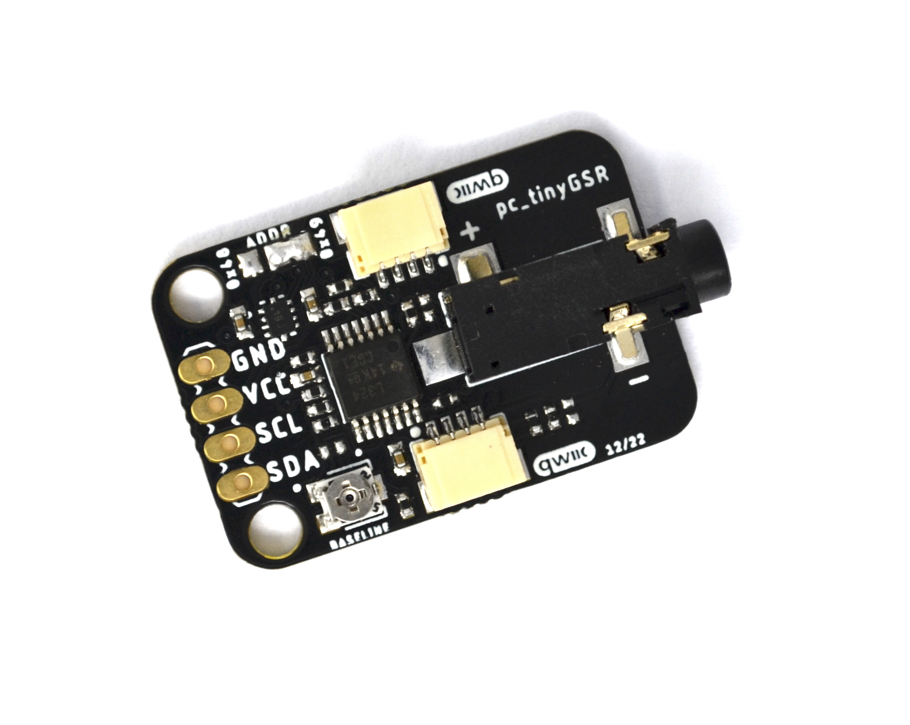
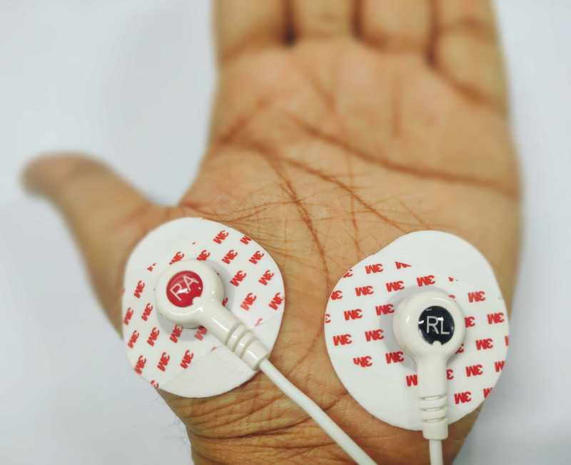

# ProtoCentral tinyGSR 

Buy one [ProtoCentral tinyGSR breakout board - Qwiic / STEMMA QT](https://protocentral.com/product/protocentral-tinygsr-breakout-board-qwiic-stemma-qt/)

ProtoCentral tinyGSR breakout board can be used to measure the electrical conductivity of the skin. GSR is a galvanic skin response (GSR) that assesses a person’s emotional state or arousal level by monitoring variations in sweat gland activity. When a person is emotionally aroused or stressed, their sweat gland activity increases, which can be measured as changes in the electrical conductivity of the skin. With onboard LM324P Operational Amplifiers & TLA2022 has 12-bit resolution ADC and can operate at a sample rate of 3.3 kSPS (thousands of samples per second) through an I2C interface.

## Wiring the board to your Arduino

If you have bought the breakout the connection with the Arduino board is as follows:

|tinyGSR pin label| Arduino Connection   |Pin Function      |
|----------------- |:--------------------:|-----------------:|
| VCC             | +5V                   |  Supply voltage       |
| SDA              | A4               |  Serial data   |
| SCL              | A5            | Serial clock          |
| GND              | Gnd  

### Interfacing with Qwiic
The tinyGSR has an On-board Qwiic compatible connectors to bring flexibility in interfacing. It makes prototyping easy, less complex and interfacing with I2C has been put up simple. The board has built-in support for popular qwiic sensors. This would make it more suitable to plug in, detect the sensor, upload the code and read data.

## Programming
* [Download and Install the IDE](https://www.arduino.cc/en/software)
* [ProtoCentral tinyGSR github repository](https://github.com/Protocentral/protocentral_tinygsr)

### Install the supporting Library
It can be found in the ‘Sketch’ menu under ‘Include Library’, ‘Manage Libraries’, and then enter the keyword ‘ProtoCentral TLA202x’ & ‘FIR Filter’ to see the library. When you click on the library, the ‘Install’ button will appear. When you click that button, the library should be installed automatically. When the installation is complete, close the Library Manager.

* Protocentral TLA20xx
* FIR Filter

### Running the Arduino Sketch
If you have correctly installed the libraries, the example sketches should now be available from within Arduino.
Open up your Arduino IDE and run the Arudino sketch (.ino) file. Your Arduino should now be programmed to read output over the USB-UART.

## Extending tinyGSR
ProtoCentral tinyGSR can be used to detect skin conductance response (SCR), also known as galvanic skin response (GSR). It is a technique that measures changes in the electrical conductance of the skin, which is thought to be related to sweat gland activity and, therefore, to emotional arousal.

### Connecting the Electrodes
A 2-electrode cable along with a standard stereo jack is provided along with the kit to connect the electrodes to the board. The other side of the electrode connector would connect to Snap-on electrodes attached to the palm.

Important Warning: When connecting the electrodes to the body, it is safer to disconnect the mains power source to the Arduino. For example, if you are using the Arduino along with a laptop, disconnecting the battery charger from the laptop would be a safe option.

# Visualizing data using the ProtoCentral OpenView GUI

The GUI for visualizing the skin response is written in Processing, based on Java and is cross-compliable across platforms.

Java 8 is required on all platforms for running the processing-based GUI application. You can download Java for your platform from the Official Java website.

You can download and install ProtoCentral OpenView from [this GitHub Repo](https://github.com/Protocentral/protocentral_openview). You can also program your Arduino with the example sketch specific to OpenView.

Once you have opened the OpenView GUI, make sure to select “tinyGSR” under the “Board” dropdown. If everything goes well, you will be able to see the output.

License Information
===================

This product is open source! Both, our hardware and software are open source and licensed under the following licenses:

Hardware
---------

**All hardware is released under the [CERN-OHL-P v2](https://ohwr.org/cern_ohl_p_v2.txt)** license.

Copyright CERN 2020.

This source describes Open Hardware and is licensed under the CERN-OHL-P v2.

You may redistribute and modify this documentation and make products
using it under the terms of the CERN-OHL-P v2 (https:/cern.ch/cern-ohl).
This documentation is distributed WITHOUT ANY EXPRESS OR IMPLIED
WARRANTY, INCLUDING OF MERCHANTABILITY, SATISFACTORY QUALITY
AND FITNESS FOR A PARTICULAR PURPOSE. Please see the CERN-OHL-P v2
for applicable conditions

Software
--------

**All software is released under the MIT License(http://opensource.org/licenses/MIT).**

THE SOFTWARE IS PROVIDED "AS IS", WITHOUT WARRANTY OF ANY KIND, EXPRESS OR IMPLIED, INCLUDING BUT NOT LIMITED TO THE WARRANTIES OF MERCHANTABILITY, FITNESS FOR A PARTICULAR PURPOSE AND NONINFRINGEMENT. IN NO EVENT SHALL THE AUTHORS OR COPYRIGHT HOLDERS BE LIABLE FOR ANY CLAIM, DAMAGES OR OTHER LIABILITY, WHETHER IN AN ACTION OF CONTRACT, TORT OR OTHERWISE, ARISING FROM, OUT OF OR IN CONNECTION WITH THE SOFTWARE OR THE USE OR OTHER DEALINGS IN THE SOFTWARE.

Documentation
-------------
**All documentation is released under [Creative Commons Share-alike 4.0 International](http://creativecommons.org/licenses/by-sa/4.0/).**

You are free to:

* Share — copy and redistribute the material in any medium or format
* Adapt — remix, transform, and build upon the material for any purpose, even commercially.
The licensor cannot revoke these freedoms as long as you follow the license terms.

Under the following terms:

* Attribution — You must give appropriate credit, provide a link to the license, and indicate if changes were made. You may do so in any reasonable manner, but not in any way that suggests the licensor endorses you or your use.
* ShareAlike — If you remix, transform, or build upon the material, you must distribute your contributions under the same license as the original.

Please check [*LICENSE.md*](LICENSE.md) for detailed license descriptions.
